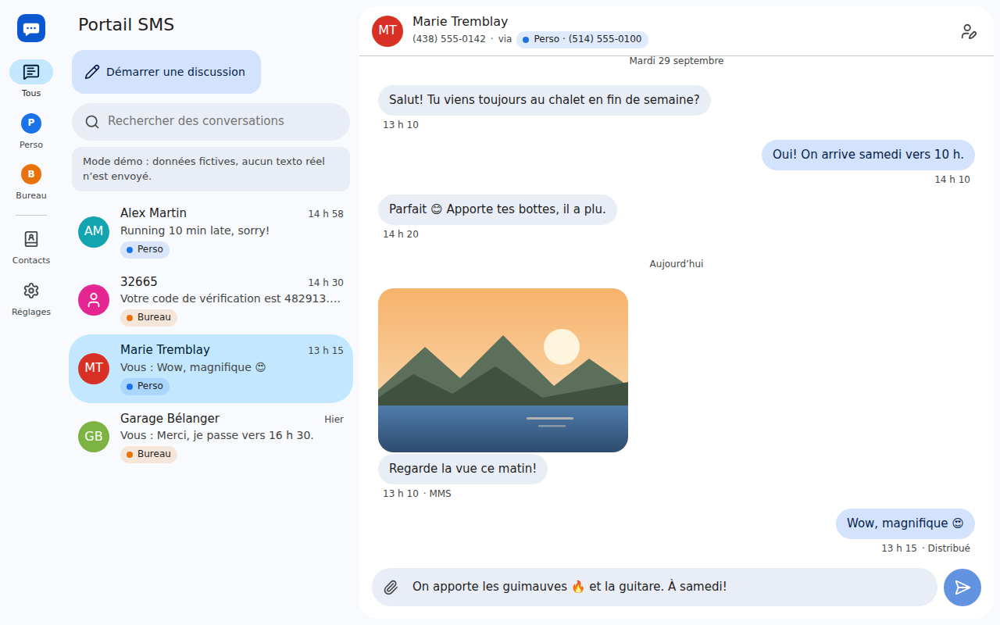
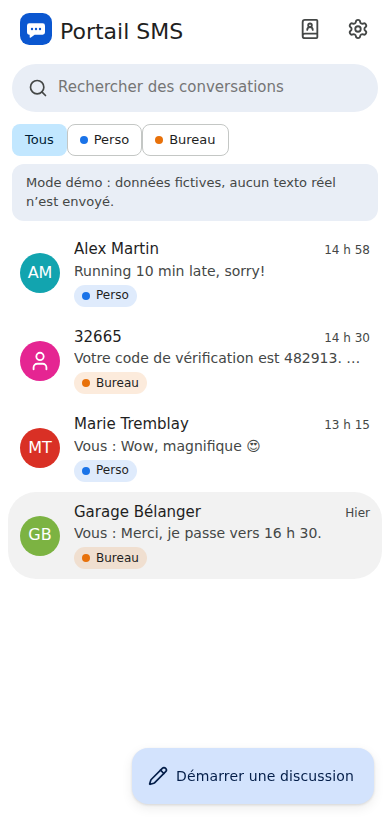
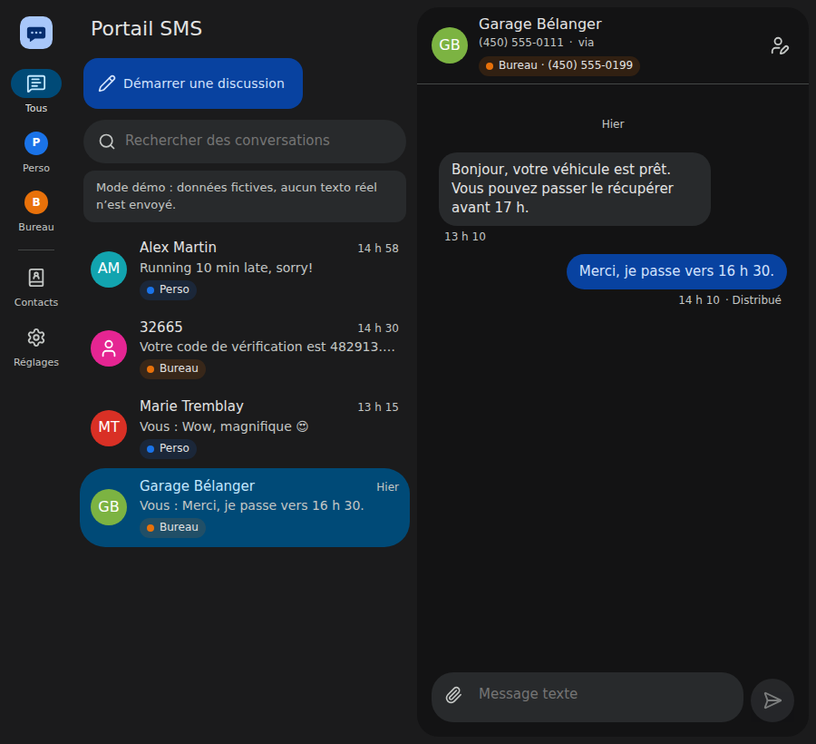
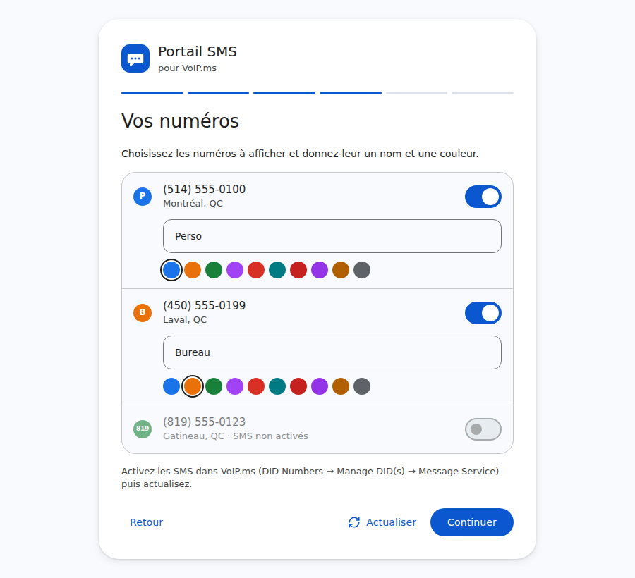

# Portail SMS pour VoIP.ms

Une interface web moderne et auto-hébergée pour les textos (SMS/MMS) de vos numéros [VoIP.ms](https://voip.ms), dans l'esprit de Google Messages pour le Web.

*[English version](README.md)*



- **Tous vos numéros au même endroit.** Un menu latéral (des pastilles sur mobile) bascule entre « tous les numéros » et chaque DID. Donnez un nom et une couleur à chaque numéro ; chaque conversation indique à quel numéro elle appartient et les réponses partent toujours de ce numéro.
- **Réception sans rien exposer sur Internet.** Le serveur interroge VoIP.ms : toutes les 10 s quand l'application est ouverte dans un navigateur, toutes les 60 s sinon. Les messages reçus pendant un arrêt du serveur sont récupérés au redémarrage.
- **SMS ou MMS, automatiquement.** VoIP.ms compte sa limite de 160 caractères en *octets* (une lettre accentuée compte pour 2, un émoji pour 4). La zone de saisie affiche le compte et passe en MMS au besoin, ou dès qu'un fichier est joint.
- **Pièces jointes.** Photos, vidéos, sons et vCard (3 par message) ; les grosses photos sont redimensionnées dans le navigateur pour respecter la limite de 1,2 Mo de VoIP.ms. Les médias reçus sont téléchargés et conservés localement.
- **Assistant de configuration.** Il explique comment activer l'API, affiche l'adresse IP exacte à autoriser, teste la connexion, liste vos numéros et importe l'historique.
- **Contacts** avec import vCard (Google Contacts, iCloud, Android…), recherche, notifications du navigateur, thèmes clair et sombre, français et anglais, installable comme une application sur téléphone.

| Mobile | Thème sombre | Configuration |
| --- | --- | --- |
|  |  |  |

## Démarrage rapide (Docker)

```bash
git clone https://github.com/dansleboby/voip-ms-sms-portal.git
cd voip-ms-sms-portal
cp .env.example .env        # puis définissez APP_PASSWORD
docker compose up -d --build
```

Ouvrez <http://localhost:8080>, connectez-vous avec `APP_PASSWORD` et suivez l'assistant. Les données (base SQLite et médias) sont dans `./data`.

Pour faire le tour avant de brancher votre compte : `DEMO_MODE=true` affiche des numéros et des conversations fictifs, avec une réponse automatique, sans envoyer de vrais textos.

## Configuration

| Variable | Défaut | Description |
| --- | --- | --- |
| `APP_PASSWORD` | *(obligatoire)* | Mot de passe protégeant l'interface. Le changer déconnecte tout le monde. |
| `VOIPMS_API_USERNAME` / `VOIPMS_API_PASSWORD` | | Courriel du compte VoIP.ms et mot de passe API. Facultatif : sinon, ils sont saisis dans l'assistant et chiffrés avec une clé dérivée d'`APP_PASSWORD`. |
| `POLL_INTERVAL_ACTIVE` | `10` | Secondes entre deux vérifications quand un onglet est ouvert. |
| `POLL_INTERVAL_IDLE` | `60` | Secondes entre deux vérifications sinon. |
| `TRUST_PROXY` | `false` | `true` derrière un proxy inverse qui gère le HTTPS (cookies sécurisés, vraie IP des clients). |
| `DATA_DIR` | `./data` (`/data` dans Docker) | Emplacement de la base et des médias. |
| `PORT` | `8080` | Port HTTP. |
| `SESSION_DAYS` | `30` | Durée d'une connexion. |
| `VOIPMS_TIMEZONE` | `America/New_York` | Fuseau des dates renvoyées par VoIP.ms. À laisser tel quel. |
| `DEMO_MODE` | `false` | Données fictives au lieu d'un vrai compte. |

## Préparer votre compte VoIP.ms

1. **Accès API** : dans le portail VoIP.ms, *Main Menu → SOAP & REST/JSON API* : définissez un **mot de passe API** (différent de votre mot de passe de connexion) et cliquez sur *Enable/Disable API*.
2. **IP autorisée** : VoIP.ms ne répond qu'aux adresses autorisées. L'assistant affiche l'adresse que VoIP.ms voit pour votre serveur ; ajoutez-la dans *Enable IP Addresses*. Pour une connexion résidentielle dont l'IP change, VoIP.ms accepte aussi les plages (`203.0.113.0/24`), les jokers (`203.0.113.*`) et les noms de domaine (DNS dynamique).
3. **SMS sur vos numéros** : *DID Numbers → Manage DID(s)*, modifiez le numéro, *Message Service (SMS/MMS)* → activer. Par défaut, VoIP.ms limite l'envoi par l'API à 100 SMS par jour ([messaging@voip.ms](mailto:messaging@voip.ms) peut l'augmenter).

## Sécurité

- Le mot de passe API de VoIP.ms **donne accès à tout le compte** (commander ou annuler des numéros, routage des appels, messagerie vocale…) et ne peut pas être restreint. Gardez cette instance privée et protégée par un `APP_PASSWORD` solide.
- Mettez-la derrière HTTPS si vous l'ouvrez sur Internet (voir plus bas) et définissez `TRUST_PROXY=true`.
- Les tentatives de connexion sont limitées, les sessions sont des cookies signés `HttpOnly`/`SameSite=Lax` et les écritures provenant d'un autre site sont refusées. Les fichiers reçus sont servis avec une CSP de type « sandbox ».

### Derrière un proxy inverse

Les mises à jour en direct passent par Server-Sent Events (`/api/events`) : désactivez la mise en tampon des réponses. Voir les exemples Caddy et nginx dans le [README anglais](README.md#behind-a-reverse-proxy).

## Fonctionnement

- **Synchronisation.** `getSMS` et `getMMS` sont appelés séparément (avec `all_messages=1`, VoIP.ms mélange les deux sans les distinguer, et leurs identifiants se chevauchent). Chaque message est enregistré une seule fois ; ceux envoyés d'ailleurs (votre cellulaire, le portail VoIP.ms) apparaissent aussi. La toute première synchronisation et les imports d'historique ne marquent rien comme non lu.
- **Dates.** VoIP.ms renvoie l'heure de l'Est ; son paramètre `timezone` ignore l'heure avancée, donc les dates sont converties avec le fuseau IANA.
- **Envoi.** Le message est enregistré immédiatement puis livré en arrière-plan ; si VoIP.ms échoue de façon ambiguë (délai, erreur Cloudflare 5xx) alors que le message est bien parti, il est rapproché de l'historique au lieu d'apparaître en double. Un message en échec peut être renvoyé.
- **Technologies.** Node.js 22+, Fastify, SQLite (better-sqlite3), React + Vite, TypeScript partout. Un seul conteneur, aucun service externe.

## Développement

```bash
npm install
DEMO_MODE=true APP_PASSWORD=dev npm run dev   # API sur :8080, interface sur http://localhost:5173
npm test
npm run typecheck
```

## Licence

[Apache 2.0](LICENSE). Projet non affilié à VoIP.ms.
