# Portail SMS pour VoIP.ms

Une interface web moderne et auto-hébergée pour les textos (SMS/MMS) de vos numéros [VoIP.ms](https://voip.ms), dans l'esprit de Google Messages pour le Web.

*[English version](README.md)*

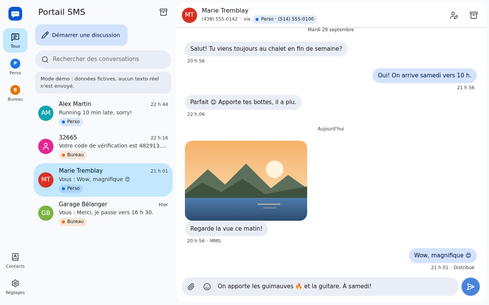

- **Tous vos numéros au même endroit.** Un menu latéral (des pastilles sur mobile) bascule entre « tous les numéros » et chaque DID. Donnez un nom et une couleur à chaque numéro ; chaque conversation indique à quel numéro elle appartient et les réponses partent toujours de ce numéro.
- **Réception sans rien exposer sur Internet.** Le serveur interroge VoIP.ms : toutes les 10 s quand l'application est ouverte dans un navigateur, toutes les 60 s sinon. Les messages reçus pendant un arrêt du serveur sont récupérés au redémarrage.
- **SMS ou MMS, automatiquement.** VoIP.ms compte sa limite de 160 caractères en *octets* (une lettre accentuée compte pour 2, un émoji pour 4). La zone de saisie affiche le compte et passe en MMS au besoin, ou dès qu'un fichier est joint.
- **Pièces jointes.** Photos, vidéos, sons et vCard (3 par message) ; les grosses photos sont redimensionnées dans le navigateur pour respecter la limite de 1,2 Mo de VoIP.ms. Les médias reçus sont téléchargés et conservés localement.
- **Assistant de configuration.** Il explique comment activer l'API, affiche l'adresse IP exacte à autoriser, teste la connexion, liste vos numéros et importe l'historique.
- **Notifications push**, même quand l'application est fermée ou le téléphone verrouillé, sur chaque appareil où vous les activez.
- **Archivage** des conversations terminées ; elles reviennent dès qu'un nouveau texto arrive.
- **Contacts** avec import vCard (Google Contacts, iCloud, Android…), sélecteur d'émojis, recherche qui ignore les accents (« belanger » trouve « Bélanger »), thèmes clair et sombre, français et anglais, installable comme une application sur téléphone.

## Visite guidée

*Toutes les captures viennent du mode démo (`DEMO_MODE=true`) : les numéros, les noms et les messages sont fictifs.*

### Une boîte de réception, plusieurs numéros

Le menu de gauche liste vos numéros VoIP.ms. « Tous » regroupe toutes les conversations, avec une pastille de couleur qui indique le numéro de chacune ; choisir un numéro n'affiche que ses conversations. Contacts et Réglages sont en bas.

| Tous les numéros | Seulement le numéro « Bureau » |
| --- | --- |
| 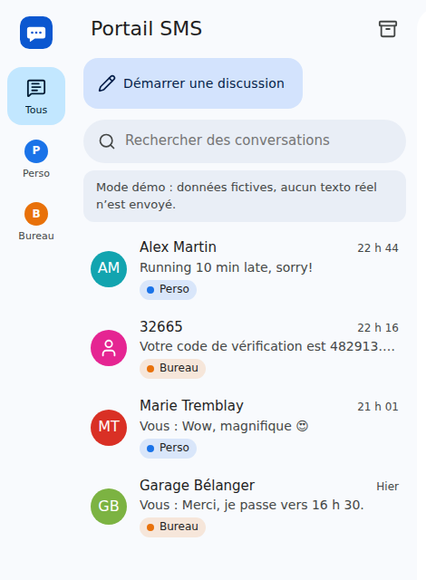 | 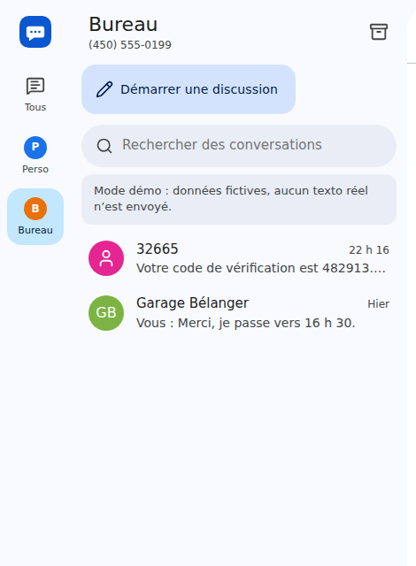 |

### SMS ou MMS : la zone de saisie décide

Tant que le texte tient dans 160 octets, il part en SMS et le compteur indique la place restante :


Un texte plus long, ou un fichier, le fait passer en MMS (jusqu'à 2048 octets). La pastille l'annonce avant l'envoi ; le message n'est jamais découpé en plusieurs SMS.

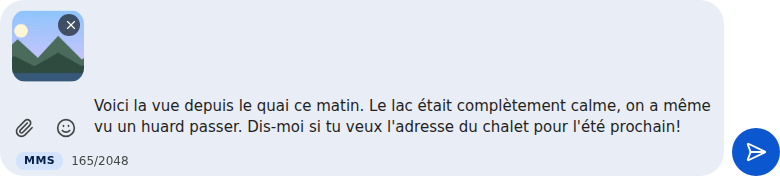

### Émojis

Le bouton en forme de bonhomme sourire ouvre un sélecteur au-dessus de la zone de saisie, avec vos émojis récents en premier. Il reste ouvert pour en ajouter plusieurs d'affilée et les insère à l'endroit du curseur.

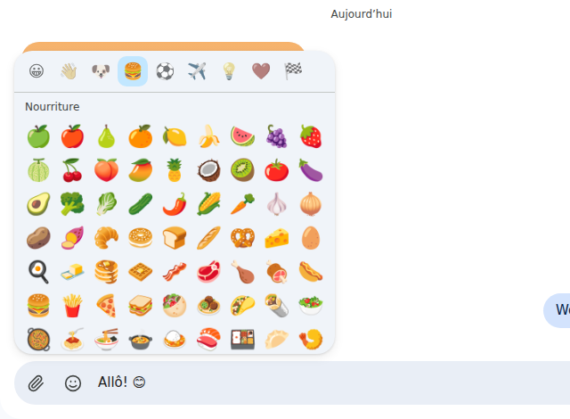

### Démarrer une discussion

Tapez un nom ou un numéro : les contacts sont suggérés au fil de la frappe. Avec plusieurs numéros, choisissez celui d'où part le texto. Si une conversation existe déjà avec cette personne sur ce numéro, vous y êtes amené.

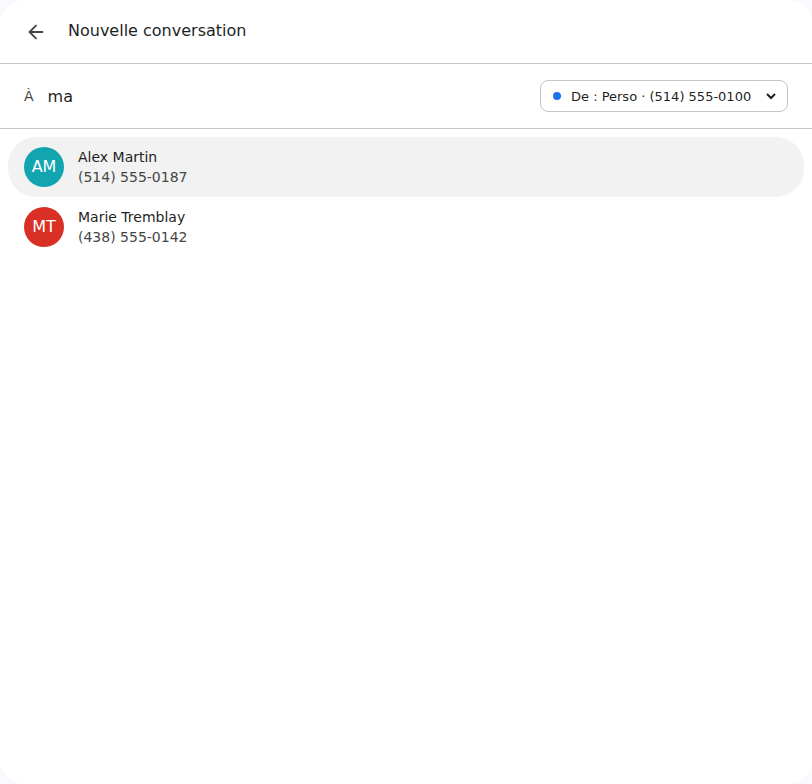

### Assistant de configuration

Au premier lancement, l'assistant vérifie les identifiants, affiche l'adresse IP que voit VoIP.ms (à ajouter à sa liste blanche), puis liste vos numéros pour les choisir, les nommer et leur donner une couleur. Les numéros dont le SMS n'est pas encore activé sont signalés, avec l'endroit où l'activer.

| Autoriser l'adresse IP | Choisir ses numéros |
| --- | --- |
| 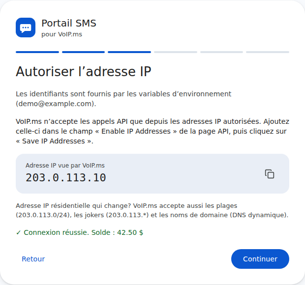 | 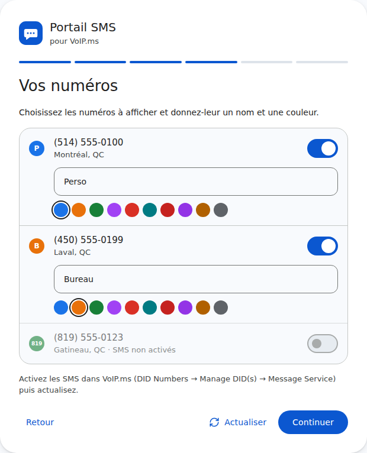 |

### Contacts

Les contacts sont enregistrés sur le serveur : tous les navigateurs voient les mêmes noms. Ajoutez-les à la main ou importez un fichier `.vcf` exporté de Google Contacts, d'iCloud ou de votre téléphone.

| Liste des contacts | Modifier un contact |
| --- | --- |
| 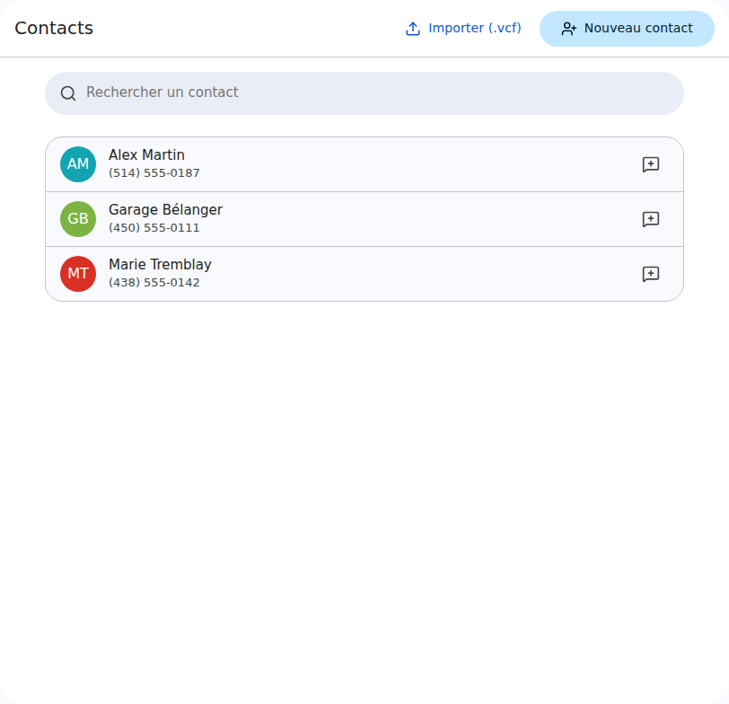 | 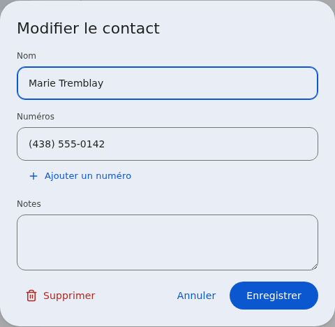 |

### Archives

Le bouton d'archivage, dans l'en-tête d'une conversation, la range (avec *Annuler*) ; l'icône de boîte au-dessus de la liste ouvre les archives. Un nouveau texto, reçu ou envoyé, ramène la conversation dans la liste principale. La recherche de la liste principale fouille aussi les conversations archivées et les signale.

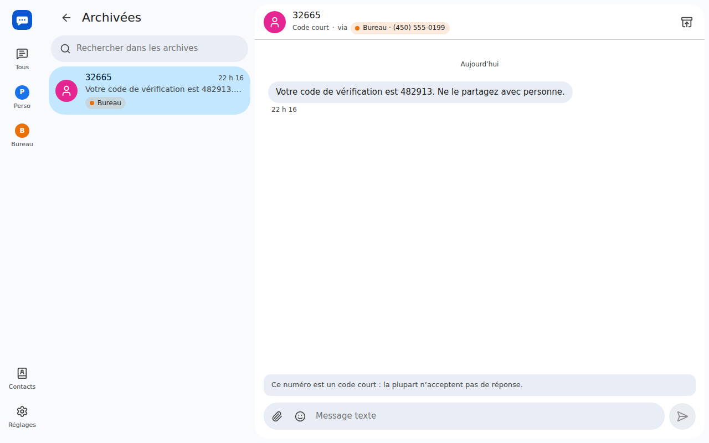

### Notifications push

Activez-les dans les Réglages, sur chaque appareil : téléphone, ordinateur, tablette. Elles arrivent même quand aucun onglet n'est ouvert et évitent l'appareil où l'application est déjà à l'écran. Voir [Mettre en place les notifications push](#mettre-en-place-les-notifications-push) pour les prérequis.

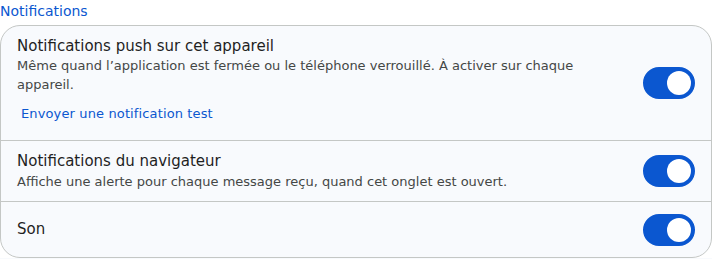

### Réglages

Renommez ou recolorez vos numéros, désactivez ceux que vous n'utilisez pas, synchronisez maintenant ou importez l'historique plus ancien, testez la connexion à VoIP.ms et choisissez les notifications, le thème et la langue.

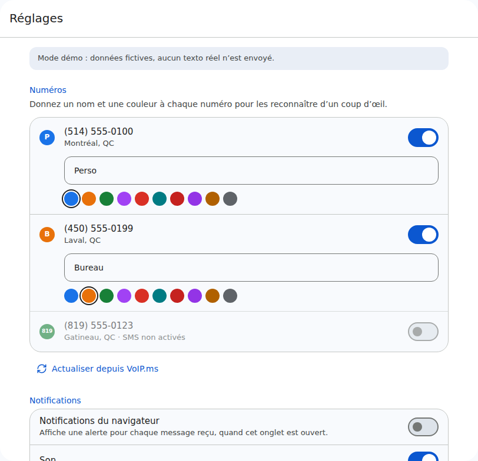

### Sur téléphone, et dans le noir

L'interface s'adapte aux petits écrans (les numéros deviennent des pastilles de filtre). Sur téléphone, un bandeau propose d'installer l'application sur l'écran d'accueil, puis d'activer les notifications. Le thème sombre suit celui du système ou peut être imposé.

| Conversations | Une conversation |
| --- | --- |
| 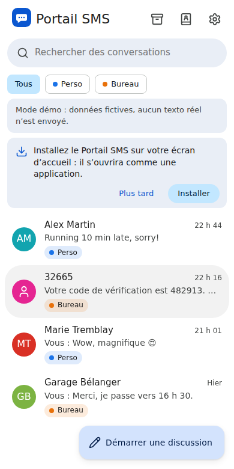 |  |

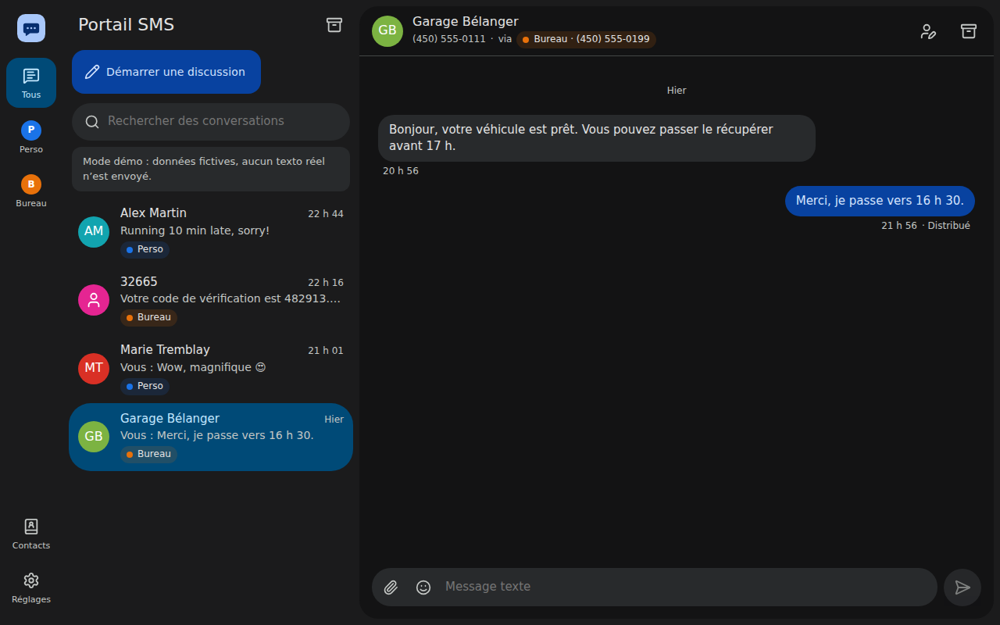

## Démarrage rapide (Docker)

```bash
git clone https://github.com/dansleboby/voip-ms-sms-portal.git
cd voip-ms-sms-portal
cp .env.example .env        # puis définissez APP_PASSWORD
docker compose up -d --build
```

Ouvrez <http://localhost:8080>, connectez-vous avec `APP_PASSWORD` et suivez l'assistant. Les données (base SQLite et médias) sont dans `./data` ; le conteneur rend ce dossier accessible en écriture à l'utilisateur de l'application au démarrage (voir `PUID`/`PGID`).

Pour faire le tour avant de brancher votre compte : `DEMO_MODE=true` affiche des numéros et des conversations fictifs, avec une réponse automatique, sans envoyer de vrais textos.

## Configuration

| Variable | Défaut | Description |
| --- | --- | --- |
| `APP_PASSWORD` | *(obligatoire)* | Mot de passe protégeant l'interface. Le changer déconnecte tout le monde. |
| `VOIPMS_API_USERNAME` / `VOIPMS_API_PASSWORD` | | Courriel du compte VoIP.ms et mot de passe API. Facultatif : sinon, ils sont saisis dans l'assistant et chiffrés avec une clé dérivée d'`APP_PASSWORD`. |
| `POLL_INTERVAL_ACTIVE` | `10` | Secondes entre deux vérifications quand un onglet est ouvert. |
| `POLL_INTERVAL_IDLE` | `60` | Secondes entre deux vérifications sinon. |
| `PUBLIC_URL` | | Adresse de l'application, comme `https://sms.example.com`. Recommandé derrière un proxy inverse : s'il ne transmet pas le `Host` et le protocole d'origine, la connexion serait refusée sans ce réglage. |
| `TRUST_PROXY` | `false` | `true` derrière un proxy inverse qui gère le HTTPS (cookies sécurisés, vraie IP des clients). `true` ne fait confiance qu'aux proxys sur la boucle locale et les réseaux privés ; on peut aussi lister des adresses/sous-réseaux (`10.0.0.5, 172.16.0.0/12`). |
| `DATA_DIR` | `./data` (`/data` dans Docker) | Emplacement de la base et des médias. |
| `PORT` | `8080` | Port HTTP. |
| `SESSION_DAYS` | `30` | Durée d'une connexion. |
| `VOIPMS_TIMEZONE` | `America/New_York` | Fuseau des dates renvoyées par VoIP.ms. À laisser tel quel. |
| `VAPID_SUBJECT` | URL du projet | Contact (`mailto:vous@example.com` ou une URL `https://`) transmis aux services push des navigateurs avec chaque notification. |
| `DEMO_MODE` | `false` | Données fictives au lieu d'un vrai compte. |
| `PUID` / `PGID` | `1000` | Docker seulement : utilisateur/groupe propriétaire de `./data` qui exécute l'application (le conteneur démarre en root uniquement pour corriger le propriétaire du dossier, puis abandonne ces droits). |

## Préparer votre compte VoIP.ms

1. **Accès API** : dans le portail VoIP.ms, *Main Menu → SOAP & REST/JSON API* : définissez un **mot de passe API** (différent de votre mot de passe de connexion) et cliquez sur *Enable/Disable API*.
2. **IP autorisée** : VoIP.ms ne répond qu'aux adresses autorisées. L'assistant affiche l'adresse que VoIP.ms voit pour votre serveur ; ajoutez-la dans *Enable IP Addresses*. Pour une connexion résidentielle dont l'IP change, VoIP.ms accepte aussi les plages (`203.0.113.0/24`), les jokers (`203.0.113.*`) et les noms de domaine (DNS dynamique).
3. **SMS sur vos numéros** : *DID Numbers → Manage DID(s)*, modifiez le numéro, *Message Service (SMS/MMS)* → activer. Par défaut, VoIP.ms limite l'envoi par l'API à 100 SMS par jour ([messaging@voip.ms](mailto:messaging@voip.ms) peut l'augmenter).

## Sécurité

- Le mot de passe API de VoIP.ms **donne accès à tout le compte** (commander ou annuler des numéros, routage des appels, messagerie vocale…) et ne peut pas être restreint. Gardez cette instance privée et protégée par un `APP_PASSWORD` solide.
- Mettez-la derrière HTTPS si vous l'ouvrez sur Internet (voir plus bas) et définissez `TRUST_PROXY=true`. Assurez-vous alors que le port de l'application n'est joignable que par le proxy (par exemple `127.0.0.1:8080:8080` dans `docker-compose.yml`).
- Les tentatives de connexion sont limitées, les sessions sont des cookies signés `HttpOnly`/`SameSite=Lax` et les écritures provenant d'un autre site sont refusées. Les fichiers reçus sont servis avec une CSP de type « sandbox ».

### Derrière un proxy inverse

Les mises à jour en direct passent par Server-Sent Events (`/api/events`) : désactivez la mise en tampon des réponses. Voir les exemples Caddy et nginx dans le [README anglais](README.md#behind-a-reverse-proxy).

## Mettre en place les notifications push

- **HTTPS obligatoire** pour les navigateurs (`http://localhost` fonctionne pour les essais). Placez l'application derrière un proxy inverse (voir plus haut).
- **À activer sur chaque appareil** dans *Réglages → Notifications*. *Envoyer une notification test* vérifie toute la chaîne.
- **iPhone et iPad** (iOS 16.4 ou plus récent) : ouvrez le site dans Safari, *Partager → Sur l'écran d'accueil*, puis activez les notifications depuis l'application installée. Safari n'offre pas le push aux onglets ordinaires.
- **Délai.** VoIP.ms est interrogé périodiquement : sans onglet ouvert, une notification arrive au plus `POLL_INTERVAL_IDLE` secondes (60 par défaut) après le texto. Réduisez-le (par exemple à `20`) pour être averti plus vite.
- **Confidentialité.** Les notifications affichent l'expéditeur et le début du texto. Elles sont chiffrées pour le navigateur qui les reçoit : Google, Mozilla, Apple ou Microsoft, qui les relaient, voient seulement qu'une notification a été envoyée. Se déconnecter d'un appareil arrête ses notifications ; changer `APP_PASSWORD` les arrête partout.
- Les clés VAPID du serveur sont créées au premier démarrage et conservées dans la base (`./data`) ; aucun compte chez un fournisseur de push n'est nécessaire.

## Fonctionnement

- **Synchronisation.** `getSMS` et `getMMS` sont appelés séparément (avec `all_messages=1`, VoIP.ms mélange les deux sans les distinguer, et leurs identifiants se chevauchent). Chaque message est enregistré une seule fois ; ceux envoyés d'ailleurs (votre cellulaire, le portail VoIP.ms) apparaissent aussi. La toute première synchronisation et les imports d'historique ne marquent rien comme non lu.
- **Médias.** Les liens des médias VoIP.ms sont publics et peuvent répondre 404 un moment après l'envoi : les téléchargements sont réessayés avec un délai croissant pendant environ 6 heures (et à la demande depuis la conversation).
- **Dates.** VoIP.ms renvoie l'heure de l'Est ; son paramètre `timezone` ignore l'heure avancée, donc les dates sont converties avec le fuseau IANA.
- **Push.** Chaque navigateur a un identifiant aléatoire, partagé par ses onglets et son abonnement push ; les onglets ouverts signalent s'ils sont visibles et le serveur évite les navigateurs qui affichent l'application. Les messages sont chiffrés selon la RFC 8291 et signés avec VAPID (RFC 8292) par le module crypto de Node, sans bibliothèque tierce.
- **Envoi.** Le message est enregistré immédiatement puis livré en arrière-plan ; si VoIP.ms échoue de façon ambiguë (délai, erreur Cloudflare 5xx) alors que le message est bien parti, il est rapproché de l'historique au lieu d'apparaître en double. Un message en échec peut être renvoyé.
- **Technologies.** Node.js 22+, Fastify, SQLite (better-sqlite3), React + Vite, TypeScript partout. Un seul conteneur, aucun service externe.

## Développement

```bash
npm install
DEMO_MODE=true APP_PASSWORD=dev npm run dev   # API sur :8080, interface sur http://localhost:5173
npm test
npm run typecheck
```

### Versions

La version est dans `package.json` et s'affiche au bas des *Réglages* ; les changements sont listés dans [CHANGELOG.md](CHANGELOG.md). Pour en publier une : `npm version <major|minor|patch> --no-git-tag-version`, ajoutez sa section au journal des changements, fusionnez, puis étiquetez le commit de fusion `vX.Y.Z`. Après une mise à jour, les onglets déjà ouverts proposent de recharger la page.

## Licence

[Apache 2.0](LICENSE). Projet non affilié à VoIP.ms.
