# SMS Portal for VoIP.ms

A clean, modern, self-hosted web interface for the texts (SMS/MMS) of your [VoIP.ms](https://voip.ms) numbers, in the spirit of Google Messages for web.

*[Version française](README.fr.md)*

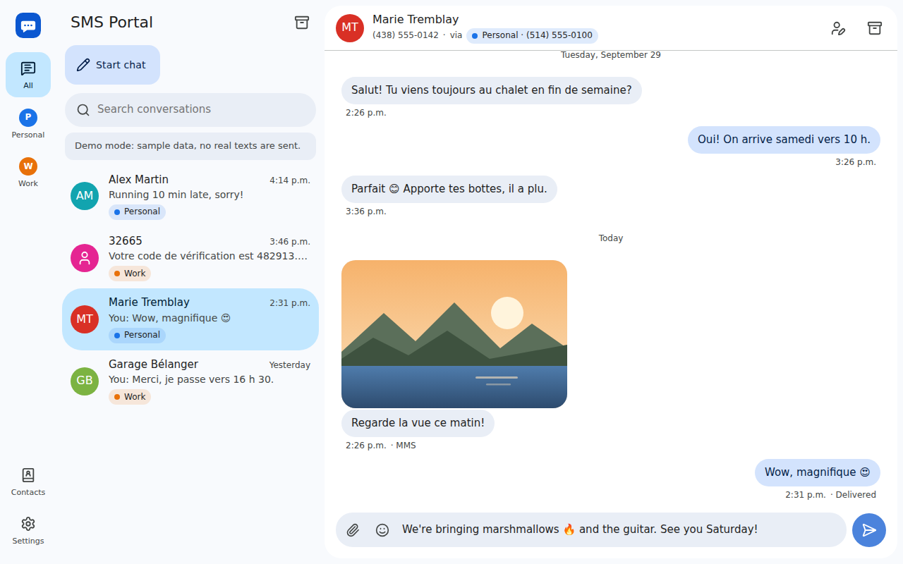

- **All your numbers in one place.** A side rail (filter chips on mobile) switches between "all numbers" and each DID. Give every number a name and a color to recognize it at a glance; each conversation shows which of your numbers it belongs to and replies always leave from that number.
- **Incoming texts without exposing anything to the Internet.** The server polls VoIP.ms: every 10 s while the app is open in a browser, every 60 s otherwise. Messages received while the server was down are fetched when it comes back.
- **SMS or MMS, automatically.** VoIP.ms counts its 160-character SMS limit in *bytes* (an accented letter counts for 2, an emoji for 4). The message box shows the count and switches to MMS when needed, or when you attach a file.
- **Attachments.** Send pictures, videos, audio clips and vCards (up to 3 per message); large photos are resized in the browser to fit VoIP.ms's 1.2 MB limit. Received media is downloaded and kept locally.
- **Setup wizard.** It walks you through enabling the API, shows the exact IP address to whitelist, tests the connection, lists your numbers and imports your history.
- **Push notifications**, even when the app is closed or the phone locked, on every device where you turn them on.
- **Archive** the conversations you are done with; they come back as soon as a new text arrives.
- **Contacts** with vCard import (Google Contacts, iCloud, Android…), an emoji picker, search that ignores accents ("belanger" finds "Bélanger"), light/dark themes, French and English, installable as an app on phones.

## A quick tour

*All screenshots come from the demo mode (`DEMO_MODE=true`): the numbers, names and messages are made up.*

### One inbox, several numbers

The rail on the left lists your VoIP.ms numbers. "All" mixes every conversation, with a colored chip telling which number each one belongs to; picking a number shows only its conversations. Contacts and Settings sit at the bottom.

| All numbers | Only the "Work" number |
| --- | --- |
| 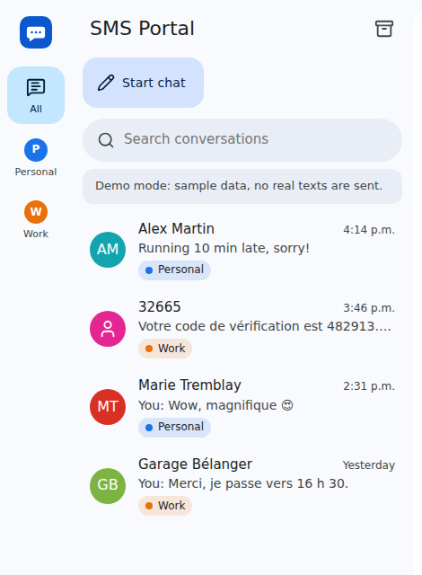 | 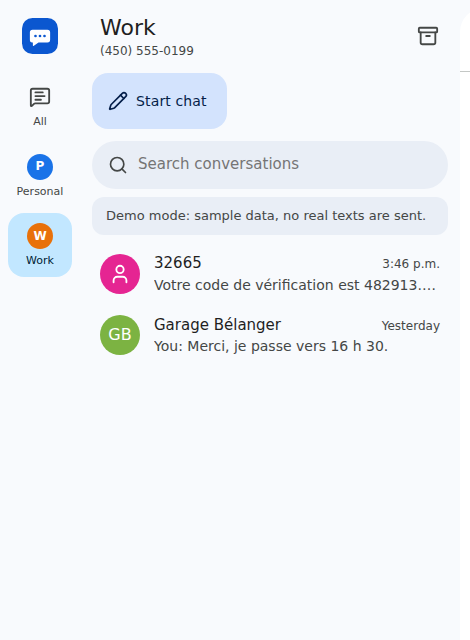 |

### SMS or MMS: the message box decides

As long as the text fits in 160 bytes, it leaves as an SMS and the counter shows how much room is left:


A longer text, or a file, turns it into an MMS (up to 2048 bytes). The chip says so before you hit send; there is no splitting into several SMS.

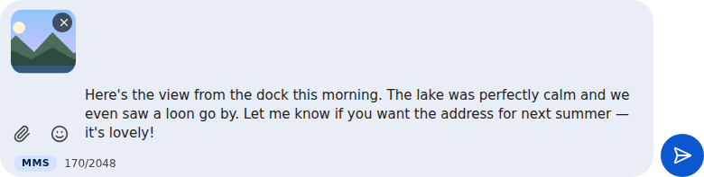

### Emoji

The smiley button opens a picker above the message box, with your recent emoji first. It stays open so you can add several in a row, and inserts them where the cursor is.

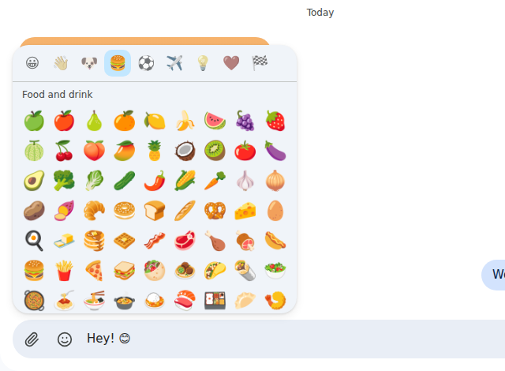

### Starting a conversation

Type a name or a number: contacts are suggested as you type. With several numbers, choose which one the text leaves from. If a conversation already exists with that person on that number, you land in it.

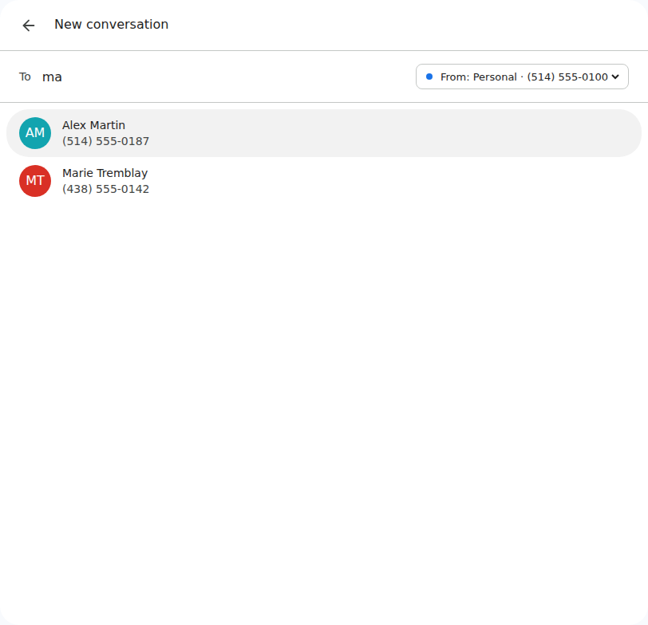

### Setup wizard

On first launch, the wizard checks the credentials, shows the IP address VoIP.ms sees (to add to its whitelist), then lists your numbers so you can pick, name and color them. Numbers where SMS is not enabled yet are flagged, with where to enable it.

| Allowing the IP address | Choosing your numbers |
| --- | --- |
| 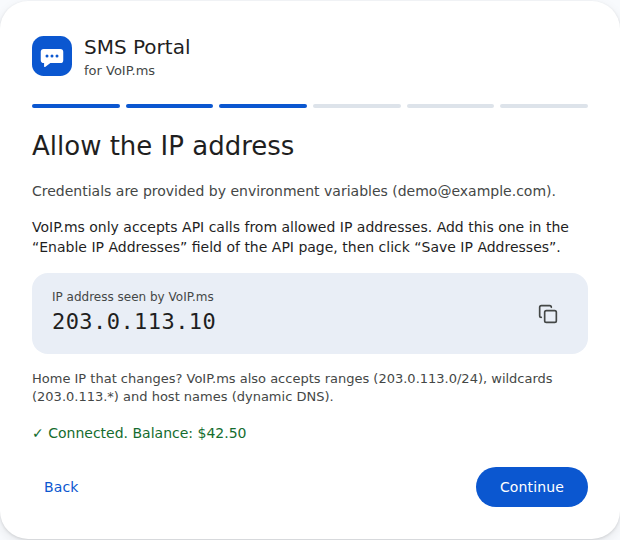 | 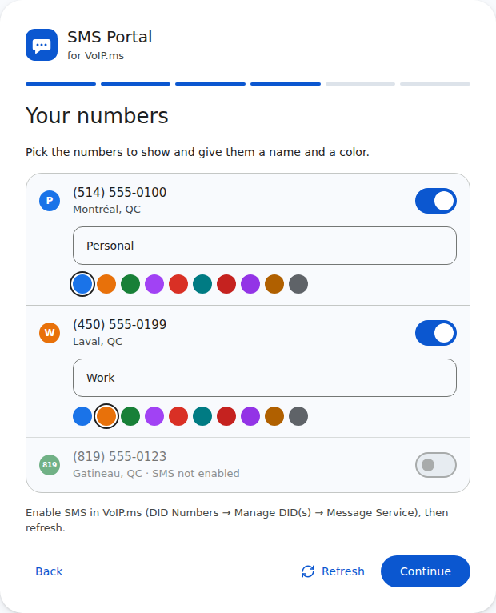 |

### Contacts

Contacts are stored on the server, so every browser sees the same names. Add them by hand or import a `.vcf` file exported from Google Contacts, iCloud or your phone.

| Contact list | Editing a contact |
| --- | --- |
| 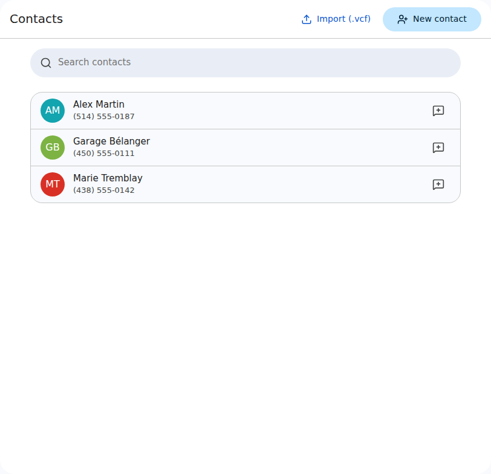 | 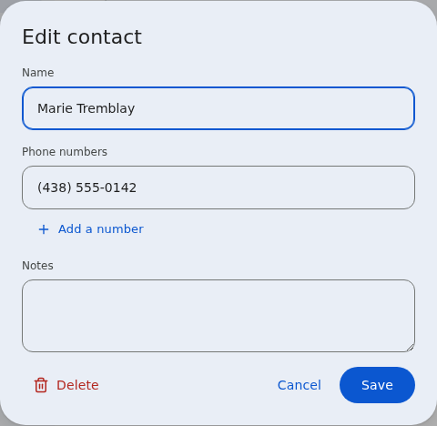 |

### Archive

The archive button in a conversation's header puts it away (with an *Undo*); the box icon above the list opens the archive. A new text, received or sent, brings the conversation back to the main list. Searching the main list also looks through archived conversations and flags them.

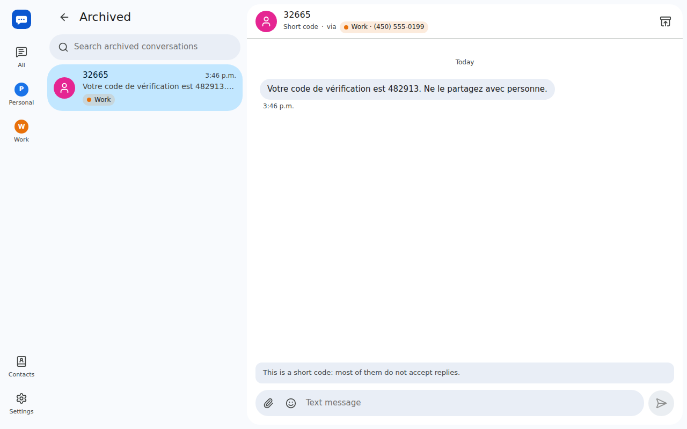

### Push notifications

Turn them on in Settings, on each device: phone, computer, tablet. They arrive even when no tab is open, and skip the device where the app is already on screen. See [Setting up push notifications](#setting-up-push-notifications) for what they need.

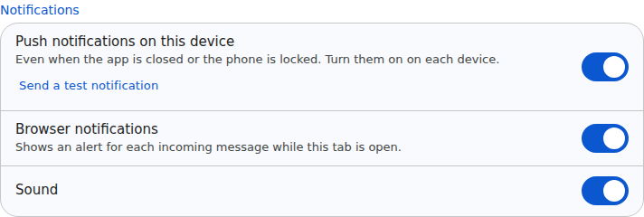

### Settings

Rename or recolor numbers, turn off the ones you do not use, sync now or import older history, test the VoIP.ms connection, and choose notifications, theme and language.

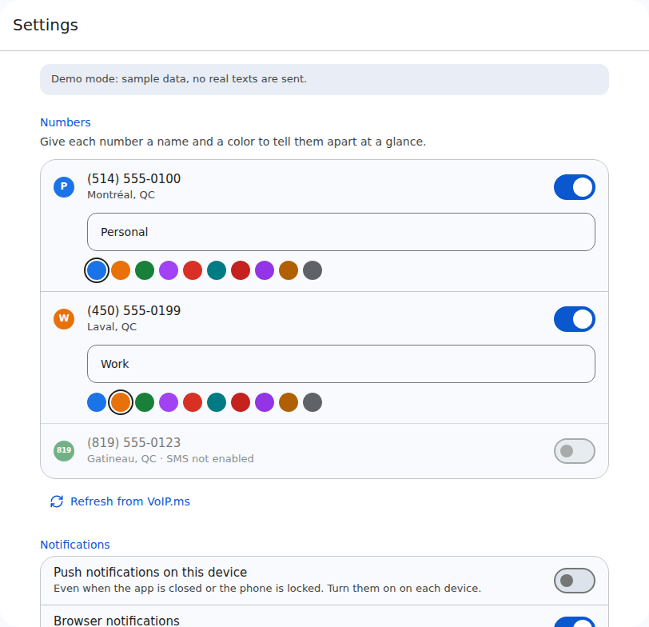

### On a phone, and in the dark

The layout adapts to small screens (numbers become filter chips) and can be installed on the home screen. The dark theme follows the system or can be forced.

| Conversations | A conversation |
| --- | --- |
| 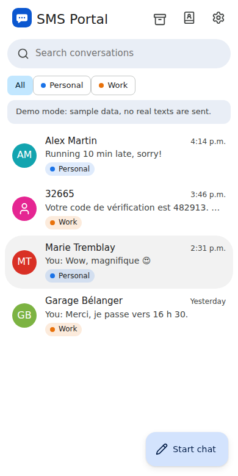 | 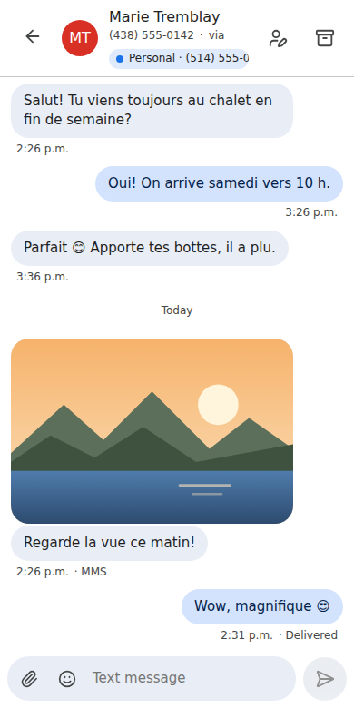 |

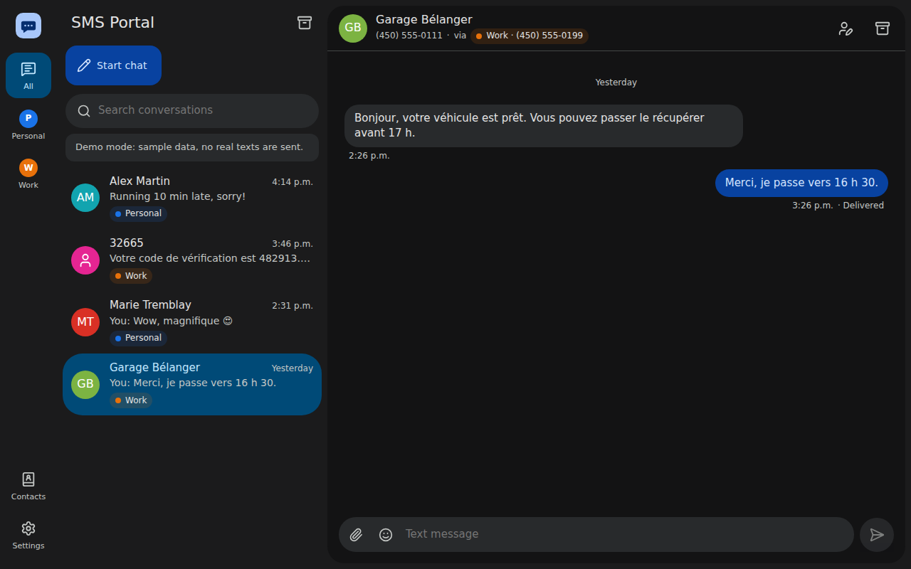

## Quick start (Docker)

```bash
git clone https://github.com/dansleboby/voip-ms-sms-portal.git
cd voip-ms-sms-portal
cp .env.example .env        # then set APP_PASSWORD
docker compose up -d --build
```

Open <http://localhost:8080>, sign in with `APP_PASSWORD` and follow the wizard. Data (SQLite database and media) lives in `./data`; the container makes it writable for the app user on startup (see `PUID`/`PGID`).

Want to look around first? Start it with `DEMO_MODE=true`: sample numbers and conversations, an auto-reply, and no real texts sent.

## Configuration

| Variable | Default | Description |
| --- | --- | --- |
| `APP_PASSWORD` | *(required)* | Password protecting the interface. Changing it signs everyone out. |
| `VOIPMS_API_USERNAME` / `VOIPMS_API_PASSWORD` | | VoIP.ms account email and API password. Optional: otherwise they are entered in the wizard and stored encrypted with a key derived from `APP_PASSWORD`. |
| `POLL_INTERVAL_ACTIVE` | `10` | Seconds between checks while a browser tab is open. |
| `POLL_INTERVAL_IDLE` | `60` | Seconds between checks when nobody is looking. |
| `TRUST_PROXY` | `false` | Set to `true` behind a reverse proxy terminating HTTPS (secure cookies, real client IP). `true` trusts proxies on loopback and private networks only; you can also list addresses/subnets (`10.0.0.5, 172.16.0.0/12`). |
| `DATA_DIR` | `./data` (`/data` in Docker) | Database and media location. |
| `PORT` | `8080` | HTTP port. |
| `SESSION_DAYS` | `30` | How long a sign-in lasts. |
| `VOIPMS_TIMEZONE` | `America/New_York` | Time zone of the dates VoIP.ms returns. Leave as is. |
| `VAPID_SUBJECT` | project URL | Contact (`mailto:you@example.com` or an `https://` URL) sent to browser push services with each notification. |
| `DEMO_MODE` | `false` | Sample data instead of a real account. |
| `PUID` / `PGID` | `1000` | Docker only: user/group that owns `./data` and runs the app (the container starts as root just to fix the folder's owner, then drops privileges). |

## Preparing your VoIP.ms account

1. **API access**: in the VoIP.ms portal, *Main Menu → SOAP & REST/JSON API*: set an **API password** (different from your login password) and click *Enable/Disable API*.
2. **Allowed IP**: VoIP.ms only answers API calls from whitelisted addresses. The wizard shows the address VoIP.ms sees for your server; add it under *Enable IP Addresses*. For a home connection whose IP changes, VoIP.ms also accepts ranges (`203.0.113.0/24`), wildcards (`203.0.113.*`) and host names (dynamic DNS).
3. **SMS on your numbers**: *DID Numbers → Manage DID(s)*, edit the number, *Message Service (SMS/MMS)* → enable. By default VoIP.ms limits sending through the API to 100 SMS per day ([messaging@voip.ms](mailto:messaging@voip.ms) can raise it).

## Security

- The VoIP.ms API password **gives access to the whole account** (ordering and cancelling numbers, call routing, voicemail…) and cannot be restricted. Keep this instance private and protected by a strong `APP_PASSWORD`.
- Put it behind HTTPS if you open it to the Internet (see below) and set `TRUST_PROXY=true`. Then make sure the app's port is only reachable through the proxy (for example `127.0.0.1:8080:8080` in `docker-compose.yml`).
- Sign-in attempts are rate limited, sessions are signed `HttpOnly`/`SameSite=Lax` cookies and cross-site writes are refused. Received files are served with a sandboxing CSP.

### Behind a reverse proxy

Live updates use Server-Sent Events (`/api/events`): disable response buffering for that path.

**Caddy**

```caddy
sms.example.com {
    reverse_proxy localhost:8080 {
        flush_interval -1
    }
}
```

**nginx**

```nginx
location / {
    proxy_pass http://127.0.0.1:8080;
    proxy_set_header Host $host;
    proxy_set_header X-Forwarded-For $proxy_add_x_forwarded_for;
    proxy_set_header X-Forwarded-Proto $scheme;
    proxy_buffering off;   # Server-Sent Events
    client_max_body_size 5m;
}
```

## Setting up push notifications

- **HTTPS is required** by browsers (plain `http://localhost` works for testing). Put the app behind a reverse proxy as shown above.
- **Turn them on on each device** in *Settings → Notifications*. *Send a test notification* checks the whole chain.
- **iPhone and iPad** (iOS 16.4 or later): open the site in Safari, *Share → Add to Home Screen*, then turn notifications on from the installed app. Safari does not offer push to regular tabs.
- **Delay.** VoIP.ms is polled, so a notification arrives at most `POLL_INTERVAL_IDLE` seconds (60 by default) after the text when no tab is open. Lower it (for example to `20`) for quicker alerts.
- **Privacy.** Notifications show the sender and the beginning of the text. They are encrypted for the receiving browser: Google, Mozilla, Apple or Microsoft, which relay them, only see that a notification was sent. Signing out of a device stops its notifications; changing `APP_PASSWORD` stops them everywhere.
- The server's VAPID keys are generated on first start and kept in the database (`./data`); no account with a push provider is needed.

## How it works

- **Sync.** `getSMS` and `getMMS` are called separately (with `all_messages=1` VoIP.ms mixes both kinds without saying which is which, and their ids overlap). Each message is stored once, keyed by kind and VoIP.ms id; messages sent from elsewhere (your phone, the VoIP.ms portal) show up too. The very first sync and history imports do not mark anything unread.
- **Media.** VoIP.ms media links are public and can answer 404 for a while after a message is sent, so downloads are retried with backoff for about 6 hours (and on demand from the conversation).
- **Dates.** VoIP.ms returns US Eastern wall-clock times; its `timezone` parameter ignores daylight saving time, so dates are converted with the IANA zone instead.
- **Push.** Each browser has a random id, shared by its tabs and its push subscription; open tabs report whether they are visible, and the server skips the browsers showing the app. Payloads are encrypted per RFC 8291 and signed with VAPID (RFC 8292) using Node's crypto, without a third-party library.
- **Sending.** A message is saved immediately and delivered in the background; if VoIP.ms fails ambiguously (timeout, Cloudflare 5xx) and the message still went out, it is matched with the history instead of appearing twice. Failed messages can be retried.
- **Stack.** Node.js 22+, Fastify, SQLite (better-sqlite3), React + Vite, TypeScript everywhere. A single container, no external service.

## Development

```bash
npm install
DEMO_MODE=true APP_PASSWORD=dev npm run dev   # API on :8080, UI on http://localhost:5173
npm test                                      # unit and API tests
npm run typecheck
npm run build && APP_PASSWORD=dev npm start   # production build
```

If your network goes through an HTTP proxy, Node's `fetch` needs `NODE_USE_ENV_PROXY=1` (Node ≥ 22.21) to use `HTTPS_PROXY`.

## Roadmap ideas

- Optional VoIP.ms webhook/URL callback for instant delivery (and instant notifications) when the instance is reachable from the Internet
- Deleting messages and conversations

## License

[Apache 2.0](LICENSE). Not affiliated with VoIP.ms.
